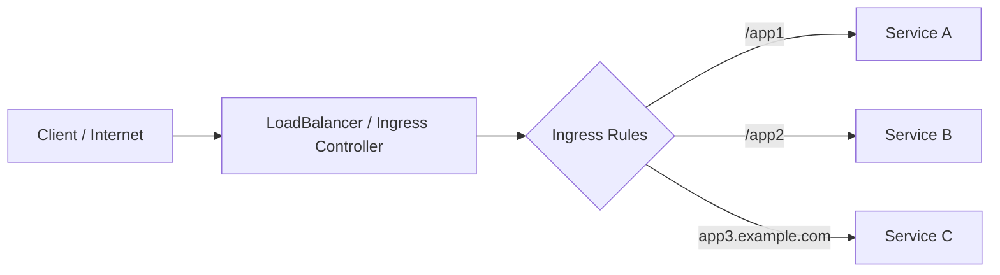
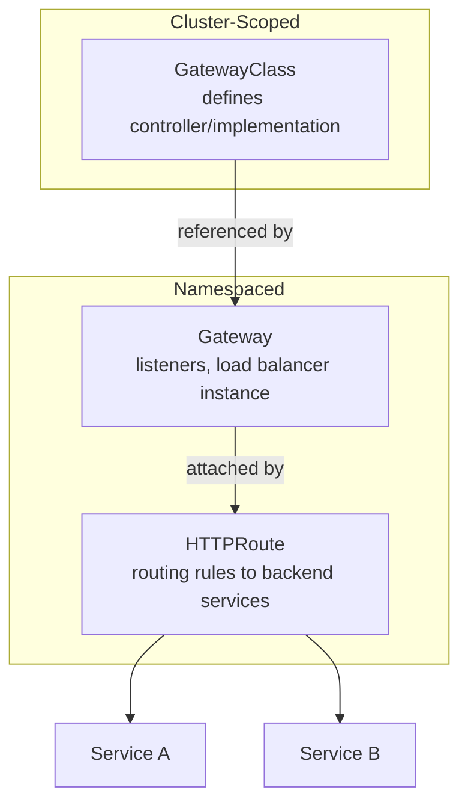
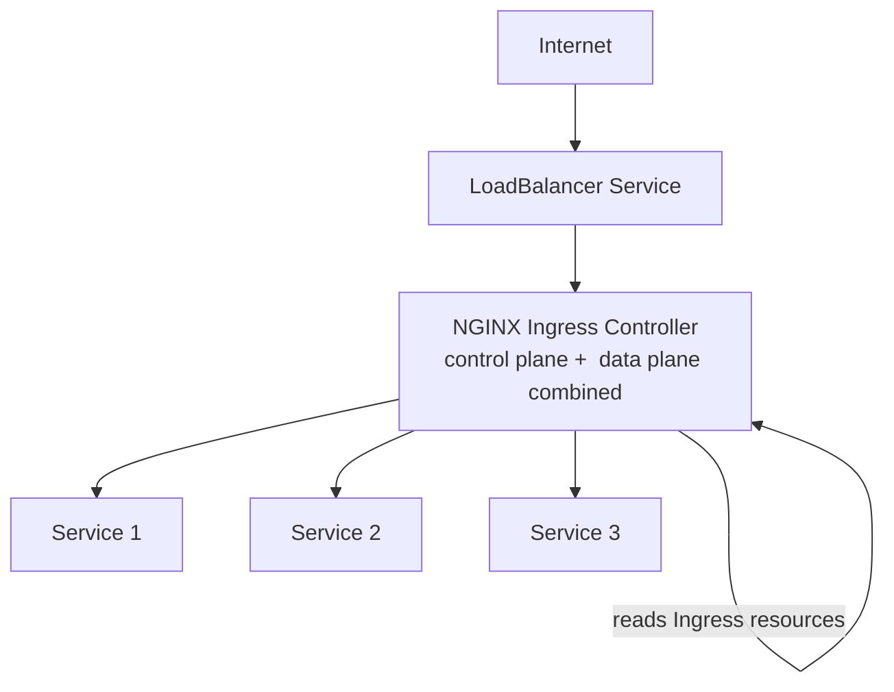
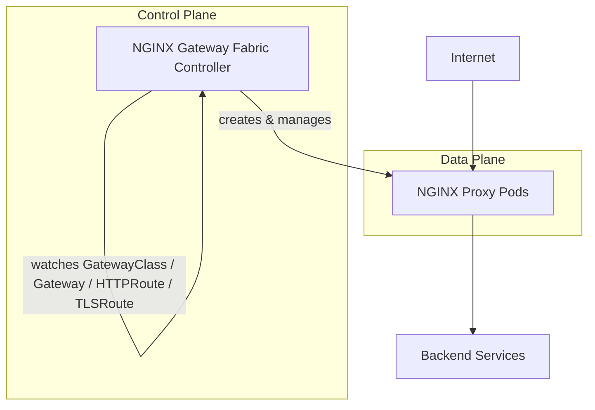
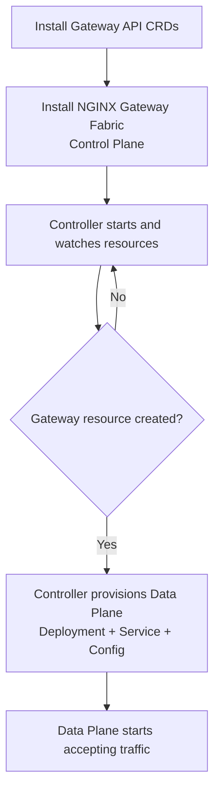

# Kubernetes Ingress vs Gateway API — Complete Reference Guide

> A structured study guide covering Kubernetes Ingress, its limitations, and how the Gateway API solves them — with architecture diagrams, comparisons, and interview Q&A.


---

## Table of Contents

1. [What is Ingress?](#1-what-is-ingress)
2. [Limitations of Ingress](#2-limitations-of-ingress)
3. [What is Gateway API?](#3-what-is-gateway-api)
4. [Gateway API Resource Model](#4-gateway-api-resource-model)
5. [Control Plane vs Data Plane](#5-control-plane-vs-data-plane)
6. [Traditional NGINX Ingress vs NGINX Gateway Fabric](#6-traditional-nginx-ingress-vs-nginx-gateway-fabric)
7. [Data Plane Lifecycle](#7-data-plane-lifecycle)
8. [Cloud-Managed vs In-Cluster Data Planes](#8-cloud-managed-vs-in-cluster-data-planes)
9. [Identifying Control Plane vs Data Plane in a Cluster](#9-identifying-control-plane-vs-data-plane-in-a-cluster)
10. [Ingress vs Gateway API — Summary Comparison](#10-ingress-vs-gateway-api--summary-comparison)
11. [Interview Questions & Key Takeaways](#11-interview-questions--key-takeaways)

---

## 1. What is Ingress?

**Ingress** is a built-in, **namespaced** Kubernetes resource used to manage external access to services in a cluster, typically for **HTTP/HTTPS traffic**. It supports **host-based** and **path-based** routing and acts as a single entry point that maps external requests to internal Services.



### How Ingress works with Annotations

Ingress on its own only defines basic routing rules. Vendor-specific behavior (SSL redirects, rewrites, rate limiting, WAF integration, etc.) is added through **annotations**.

> **Note:** Kubernetes does **not validate** annotations — they are plain metadata. It is entirely up to the **Ingress controller** (e.g., AWS Load Balancer Controller, NGINX Ingress Controller) to read these annotations and act on them. This is why annotation behavior is inconsistent across controllers and not portable.

---

## 2. Limitations of Ingress

| # | Limitation | Impact |
|---|-----------|--------|
| 1 | No native canary/traffic-splitting support | Gradual rollouts require controller-specific annotations (where available) rather than a standard API |
| 2 | No native WAF integration | Security features must be bolted on outside the Ingress spec |
| 3 | Large number of vendor-specific annotations | Configuration becomes complex, inconsistent, and error-prone |
| 4 | One load balancer per Ingress class/controller setup | Can create bottlenecks; scaling across teams is harder |
| 5 | All routing rules often centralized | Managing many services/routes in one resource becomes unwieldy |
| 6 | No native multi-tenancy | Difficult to isolate traffic/config across teams or namespaces |
| 7 | Primarily HTTP/HTTPS only | No first-class support for TCP, UDP, or gRPC |
| 8 | No API-level RBAC delegation | Any team with access to a shared Ingress resource can accidentally modify another team's routes |

### Deep dive: RBAC & Resource-Level Isolation

When multiple teams share a single Ingress resource, all of them typically need write access to manage their own routes. Kubernetes has **no built-in mechanism** to delegate control over specific hosts/paths *within* a single Ingress object. The common workaround — separate Ingress resources per team/namespace — is an **implementation pattern**, not something enforced by the Ingress API itself.

> **Note:** Some controllers partially mitigate this. For example, the **AWS Load Balancer Controller's `IngressGroup`** feature allows multiple Ingress resources (across namespaces) to share a single ALB, letting teams manage their own manifests while pointing to the same load balancer. This is a **controller-specific extension**, not part of the native Ingress spec — so it isn't portable to other controllers.

### Why Gateway API was introduced

Gateway API was built by Kubernetes SIG-Network specifically to address these gaps: canary/traffic-splitting as a first-class feature, native multi-protocol support, role-based multi-tenancy, and a portable, standardized configuration model that doesn't rely on annotations.

---

## 3. What is Gateway API?

**Gateway API** is a Kubernetes-standard API, developed by **SIG-Network**, designed to be more **expressive, extensible, and role-oriented** than Ingress.

> **SIG (Special Interest Group):** A working group within the Kubernetes open-source project focused on a specific area. **SIG-Network** owns networking APIs (Services, Ingress, Gateway API) and ensures they remain standardized, portable, and vendor-neutral.

### Key characteristics

- **Not built into Kubernetes by default** — delivered via **Custom Resource Definitions (CRDs)** that must be installed, along with a compatible controller.
- Separates **infrastructure** (Gateways) from **application routing** (Routes).
- Enables **multi-tenancy** with API-level role separation.
- Supports **multiple protocols**: HTTP, HTTPS, gRPC, TCP, UDP.
- Moves advanced traffic-management features (canary, rewrites, rate limiting, SSL redirect) into the **core API** — reducing reliance on controller-specific annotations.
- Still **actively evolving** under SIG-Network.

> **Correction/Clarification:** Gateway API is often loosely described as "cluster-scoped," but this isn't accurate for the whole API. Only **`GatewayClass`** is cluster-scoped. Both **`Gateway`** and **`HTTPRoute`** are **namespaced** resources — this is actually central to how Gateway API achieves multi-tenancy (see below).

**One-line summary:** *Gateway API = next-generation Ingress with multi-protocol support, role separation, and portable traffic management.*

---

## 4. Gateway API Resource Model

Gateway API splits responsibilities across three main resource types, plus the data plane itself.



### 4.1 GatewayClass (Cluster-scoped)

- Defines the **type of gateway implementation** and its capabilities — conceptually similar to an `IngressClass` + Ingress controller combined.
- Installed **once per cluster**; the associated controller runs at the cluster level and watches Gateway API resources cluster-wide.

### 4.2 Gateway (Namespaced)

- Represents a **specific instance** of a gateway — the actual network entry point (listeners, ports, TLS settings, load balancer).
- References which `GatewayClass`/controller should manage it.
- Exists within a namespace, representing the load balancer or proxy that the controller provisions/configures.

### 4.3 HTTPRoute (Namespaced)

- Defines **routing rules** for HTTP traffic — match conditions, backend service references, header/path-based routing, weighted traffic splitting, etc.
- Exists within a namespace and **attaches to one or more Gateways**, allowing individual teams to own their own routing rules without touching a shared Ingress object.

### 4.4 Data Plane

- Where actual traffic forwarding happens.
- Can be **in-cluster proxy pods** (NGINX, Envoy, HAProxy) or an **external cloud-managed load balancer** (ALB, GCLB, Azure App Gateway, VPC Lattice), depending on the implementation.

---

## 5. Control Plane vs Data Plane

| Plane | Responsibility | Example |
|-------|----------------|---------|
| **Control Plane** | Watches `GatewayClass`, `Gateway`, `HTTPRoute` and reconciles desired state; configures the data plane | NGINX Gateway Fabric controller updating proxy config when a new route is applied |
| **Data Plane** | Forwards and processes actual traffic according to control-plane configuration | AWS ALB (cloud-managed) or NGINX/Envoy proxy pods (in-cluster) |

**Mental model:**
- Controller = **brain** (watches API objects, computes config, triggers reloads).
- Data plane = **muscle** (where packets actually flow — cloud LB or in-cluster proxy pods).
- In cloud-managed setups, the **cloud provider's load balancer** is the data plane.
- In in-cluster setups, **proxy pods** are the data plane — the controller itself is never in the traffic hot path.

---

## 6. Traditional NGINX Ingress vs NGINX Gateway Fabric

### 6.1 Traditional NGINX Ingress Controller

The controller pod does **both** jobs — watching Kubernetes resources **and** handling live traffic. The controller *is* the proxy.



### 6.2 NGINX Gateway Fabric (Gateway API implementation)

NGINX Gateway Fabric **separates** control plane and data plane into distinct components.



There are now **two distinct components** instead of one combined pod: a controller (control plane) and dedicated proxy pods (data plane).

---

## 7. Data Plane Lifecycle

A key operational insight: **the data plane does not exist until a `Gateway` resource is created.** Installing the controller only sets up the control plane.



**Why this makes sense:** without a `Gateway` object, there is nothing to expose — so there's no reason for the controller to spin up an NGINX proxy. This is different from the traditional Ingress controller model, where the proxy is running as soon as the controller is deployed, regardless of whether any Ingress resources exist yet.

> ✅ Installing the Helm chart / controller = **Control Plane only**.
> ✅ The **Data Plane** is created only once at least one `Gateway` resource exists to serve.

---

## 8. Cloud-Managed vs In-Cluster Data Planes

Gateway API implementations fall into two broad architectural patterns.

### 8.1 Cloud-Managed

The controller runs inside the cluster but only **programs an external, cloud-managed data plane** based on `Gateway`/`Route` manifests (listeners, routing rules, TLS, backend mappings). The cloud load balancer itself handles all client traffic directly — **the controller is never in the traffic path.**

| Cloud | Controller | Data Plane Provisioned |
|-------|-----------|--------------------------|
| AWS | AWS Gateway API Controller | VPC Lattice (or ALB/NLB, depending on controller variant) |
| GCP | GKE Gateway Controller | Google Cloud Load Balancer (external or internal) |
| Azure | Azure Gateway Controller for Containers | Azure Application Gateway |

### 8.2 In-Cluster

The controller reconciles `GatewayClass`, `Gateway`, and `Route` objects and configures an **in-cluster proxy** (NGINX, Envoy, HAProxy) running as pods/DaemonSets. These proxy pods form the data plane, handling L4/L7 load balancing, TLS termination, and routing — typically exposed via a `LoadBalancer` Service (cloud) or `NodePort` (on-prem/KIND).

Examples: **NGINX Gateway Fabric, Istio Ingress Gateway, Envoy Gateway, HAProxy Ingress, Traefik**.

> ⚠ **Caveat:** In some lightweight/demo setups (e.g., certain KIND clusters), the controller may bundle a minimal proxy or rely on `kube-proxy`/L4 forwarding instead of a dedicated proxy tier. This is acceptable for demos and local testing, but is **not production-grade**.

### Side-by-side

| Scenario | Controller Location | Data Plane Location | AWS / GCP / Azure Example | Other Examples |
|----------|---------------------|----------------------|------------------------------|-----------------|
| Cloud-Managed | In-cluster | External cloud LB | AWS VPC Lattice/ALB, GCP GCLB, Azure App Gateway | AWS Load Balancer Controller, GCP Multi-Cluster Gateway, Azure Front Door |
| In-Cluster | In-cluster | In-cluster proxy pods | — | NGINX Gateway Fabric, Envoy Gateway, Istio Ingress Gateway, HAProxy Ingress, Traefik |

---

## 9. Identifying Control Plane vs Data Plane in a Cluster

**Recommended method:** list all pods in the namespace where the Gateway API controller is installed.

```bash
kubectl get pods -n <namespace>
```

Example output:

```
NAME                                              READY   STATUS
ngf-nginx-gateway-fabric-6fd9f7f9f8-vqz5c         1/1     Running   <-- Control Plane
gateway-nginx-7bb6bff5cf-6qzjp                    1/1     Running   <-- Data Plane (Proxy)
```

| Pod name pattern | Role |
|-------------------|------|
| `ngf-nginx-gateway-fabric-*` | Controller (Control Plane) |
| `gateway-nginx-*` | NGINX Proxy (Data Plane) |

---

## 10. Ingress vs Gateway API — Summary Comparison

| Feature | Ingress | Gateway API |
|---------|---------|--------------|
| Built into Kubernetes core | Yes (built-in resource) | No — requires CRDs + controller |
| Scope | Namespaced | `GatewayClass` cluster-scoped; `Gateway`/`HTTPRoute` namespaced |
| Multi-tenancy / role separation | Not native | Native, API-level (infra vs. routes owned by different roles) |
| Protocol support | HTTP/HTTPS only | HTTP, HTTPS, gRPC, TCP, UDP |
| Canary / traffic splitting | Not native (controller-specific annotations only, where supported) | First-class API feature |
| WAF integration | Not native | Better extensibility for integration |
| Configuration extensibility | Vendor-specific annotations (not validated by Kubernetes) | Structured, spec-validated fields in the API |
| Load balancer model | Typically one LB per controller/class, shared across teams | More flexible; supports multiple Gateways |
| RBAC delegation | No built-in per-host/path delegation | Routes can be owned/managed independently by different teams, attached to shared Gateways |
| Maturity | Stable, long-established | Newer, actively evolving under SIG-Network |

---

## 11. Interview Questions & Key Takeaways

### Frequently Asked Interview Questions

1. **What is the difference between Ingress and Gateway API?**
   Ingress is a built-in, HTTP(S)-only, namespaced resource with routing centralized in one object and heavy reliance on non-validated annotations. Gateway API is a CRD-based, role-oriented API that separates infrastructure (`Gateway`) from routing (`HTTPRoute`), supports multiple protocols, and enables native multi-tenancy.

2. **Why doesn't Kubernetes validate Ingress annotations?**
   Annotations are generic Kubernetes metadata, not part of the Ingress spec. Interpreting and acting on them is delegated entirely to the Ingress controller, which is why annotation behavior varies by vendor.

3. **What problem does `IngressGroup` (AWS Load Balancer Controller) solve, and why isn't it a complete fix?**
   It lets multiple Ingress resources across namespaces share a single ALB so teams can manage their own manifests independently. It's a controller-specific extension, though — not part of the native Ingress spec, so it doesn't work with other controllers.

4. **Which Gateway API resource is cluster-scoped, and which are namespaced?**
   `GatewayClass` is cluster-scoped. `Gateway` and `HTTPRoute` are namespaced — this namespacing is what enables Gateway API's multi-tenancy model.

5. **Explain the control plane vs data plane split in NGINX Gateway Fabric.**
   The NGINX Gateway Fabric controller (control plane) watches `GatewayClass`/`Gateway`/`HTTPRoute` objects and reconciles configuration. It creates and manages separate NGINX proxy pods (data plane) that actually handle traffic — unlike the traditional NGINX Ingress Controller, where one pod does both jobs.

6. **When does the data plane get created in a Gateway API in-cluster implementation?**
   Only after a `Gateway` resource is created. Installing the controller alone only sets up the control plane; there's no reason to provision a proxy until there's something to expose.

7. **How do cloud-managed and in-cluster Gateway API implementations differ?**
   In cloud-managed implementations (e.g., AWS Gateway API Controller, GKE Gateway Controller), the in-cluster controller only configures an external cloud load balancer, which handles all traffic directly. In in-cluster implementations (e.g., NGINX Gateway Fabric, Envoy Gateway), proxy pods running inside the cluster serve as the data plane.

8. **How would you identify the control plane vs data plane pods in a running cluster?**
   Run `kubectl get pods -n <namespace>` in the controller's namespace and inspect naming patterns — e.g., `ngf-nginx-gateway-fabric-*` (controller/control plane) vs `gateway-nginx-*` (proxy/data plane).

### Key Takeaways

- Ingress is simple and widely supported but limited to HTTP(S), lacks native multi-tenancy, and depends heavily on unvalidated, vendor-specific annotations.
- Gateway API is the standardized, more expressive successor — but it is **not built-in**; it requires installing CRDs and a compatible controller.
- Gateway API's three core resources — `GatewayClass`, `Gateway`, `HTTPRoute` — cleanly separate **implementation choice**, **infrastructure/listeners**, and **routing rules**.
- Always distinguish **control plane** (reconciliation logic) from **data plane** (actual traffic path) — this distinction is central to how Gateway API implementations are architected, whether cloud-managed or in-cluster.
- Some controller-specific features (like AWS `IngressGroup`) narrow the gap between Ingress and Gateway API, but remain non-portable — a core motivation for Gateway API's design.
